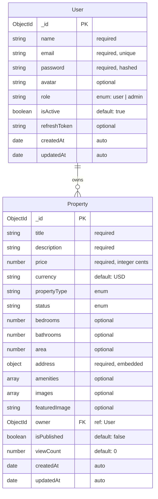
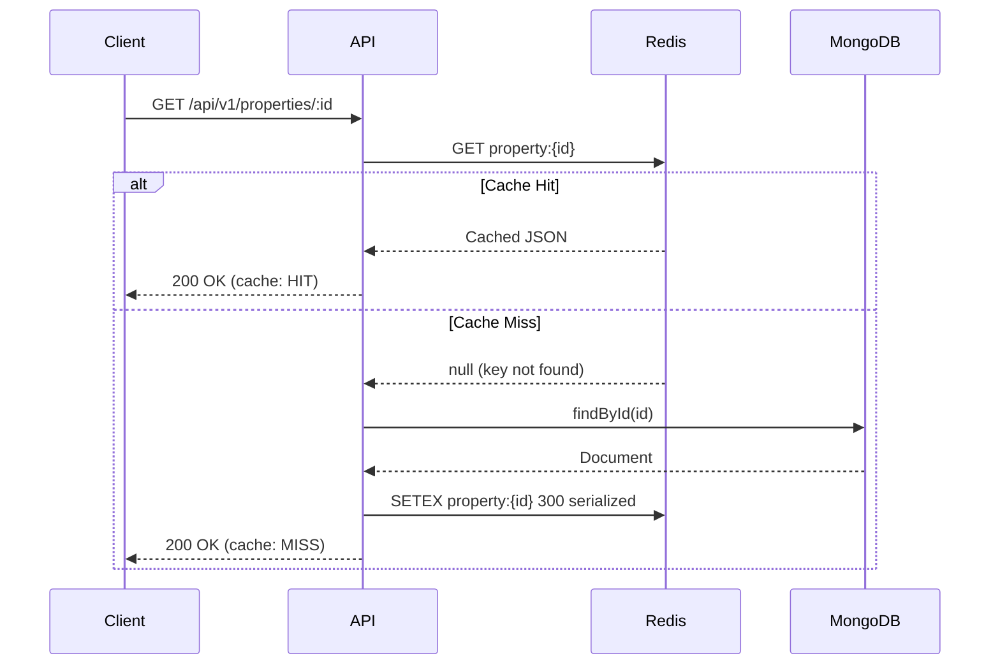
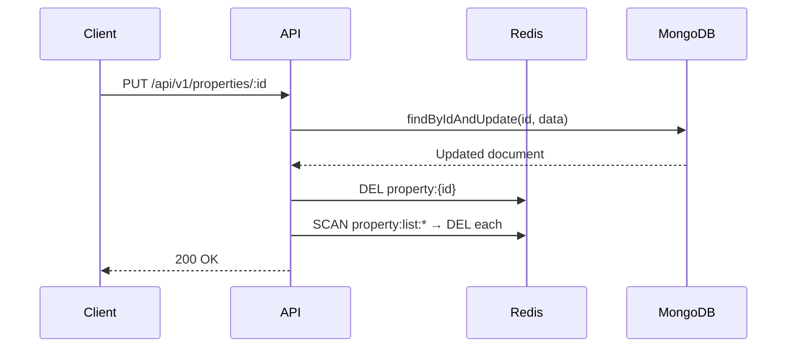
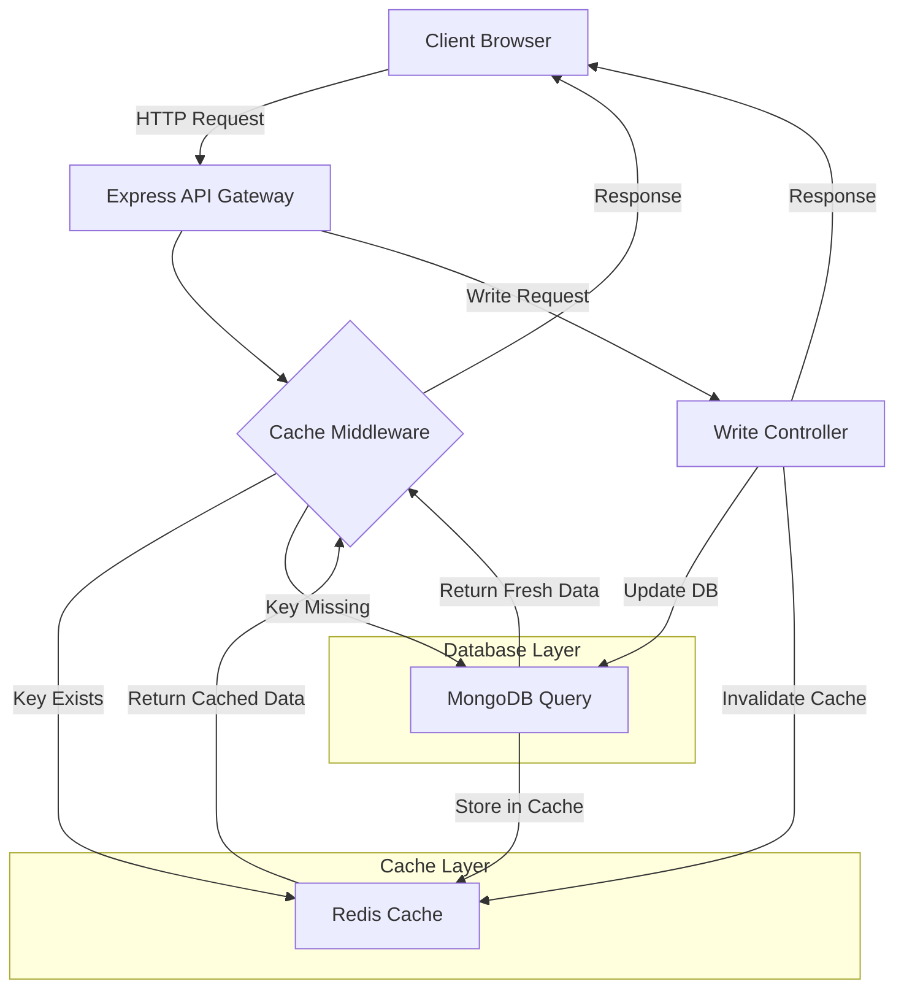

# Sprint 13 — Redis Caching for Property Listings

## Architecture & Planning Document

| **Module**        | Redis Caching for Property Listings          |
| ----------------- | -------------------------------------------- |
| **Project**       | ProDesk IT — Capstone 1                      |
| **Sprint**        | 13                                           |
| **Tech Stack**    | MongoDB, Express.js, React.js, Node.js, Redis, REST API |
| **Status**        | Architecture & Planning (No Implementation)  |

---

## Table of Contents

1. [Database Schema](#1-database-schema)
2. [ER Diagram](#2-er-diagram)
3. [REST API Contracts](#3-rest-api-contracts)
4. [Redis Caching Architecture](#4-redis-caching-architecture)
5. [Happy Path](#5-happy-path)
6. [Edge Cases](#6-edge-cases)
7. [Security](#7-security)
8. [Accessibility](#8-accessibility)
9. [Analytics](#9-analytics)
10. [UI Design Guidelines](#10-ui-design-guidelines)
11. [Non-functional Requirements](#11-non-functional-requirements)
12. [Folder Structure](#12-folder-structure)
13. [API Documentation (OpenAPI-style)](#13-api-documentation-openapi-style)
14. [Database Validation Rules](#14-database-validation-rules)
15. [Redis Key Naming Convention](#15-redis-key-naming-convention)
16. [Definition of Done Checklist](#16-definition-of-done-checklist)
17. [Assumptions](#17-assumptions)

---

## 1. Database Schema

### 1.1 Users Collection

| Field            | Type     | Required | Unique | Default        | Description                    |
| ---------------- | -------- | -------- | ------ | -------------- | ------------------------------ |
| `_id`            | ObjectId | ✓        | ✓      | Auto-generated | Primary Key                    |
| `name`           | String   | ✓        | ✗      | —              | Full name of the user          |
| `email`          | String   | ✓        | ✓      | —              | Email address (lowercased)     |
| `password`       | String   | ✓        | ✗      | —              | Bcrypt-hashed password         |
| `avatar`         | String   | ✗        | ✗      | `null`         | URL to avatar image            |
| `role`           | String   | ✓        | ✗      | `"user"`       | Enum: `user`, `admin`          |
| `isActive`       | Boolean  | ✗        | ✗      | `true`         | Soft-delete / deactivation     |
| `refreshToken`   | String   | ✗        | ✗      | `null`         | Stored refresh token           |
| `createdAt`      | Date     | ✓        | ✗      | Auto-generated | Timestamp                      |
| `updatedAt`      | Date     | ✓        | ✗      | Auto-generated | Timestamp                      |

**Indexes:**
- `{ email: 1 }` — unique index
- `{ role: 1 }` — for role-based queries

### 1.2 Properties Collection

| Field            | Type     | Required | Unique | Default        | Description                        |
| ---------------- | -------- | -------- | ------ | -------------- | ---------------------------------- |
| `_id`            | ObjectId | ✓        | ✓      | Auto-generated | Primary Key                        |
| `title`          | String   | ✓        | ✗      | —              | Property title                     |
| `description`    | String   | ✓        | ✗      | —              | Detailed description               |
| `price`          | Number   | ✓        | ✗      | —              | Price in cents (integer)           |
| `currency`       | String   | ✓        | ✗      | `"USD"`        | ISO 4217 currency code             |
| `propertyType`   | String   | ✓        | ✗      | —              | Enum: `house`, `apartment`, `condo`, `land`, `commercial` |
| `status`         | String   | ✓        | ✗      | `"available"`  | Enum: `available`, `sold`, `rented`, `pending` |
| `bedrooms`       | Number   | ✗        | ✗      | `null`         | Number of bedrooms                 |
| `bathrooms`      | Number   | ✗        | ✗      | `null`         | Number of bathrooms                |
| `area`           | Number   | ✗        | ✗      | `null`         | Area in sq ft                      |
| `address`        | Object   | ✓        | ✗      | —              | Embedded sub-document (see below)  |
| `amenities`      | [String] | ✗        | ✗      | `[]`           | Array of amenity strings           |
| `images`         | [String] | ✗        | ✗      | `[]`           | Array of image URLs                |
| `featuredImage`  | String   | ✗        | ✗      | `null`         | Primary listing image URL          |
| `owner`          | ObjectId | ✓        | ✗      | —              | Foreign Key → Users `_id`          |
| `isPublished`    | Boolean  | ✗        | ✗      | `false`        | Visibility flag                    |
| `viewCount`      | Number   | ✗        | ✗      | `0`            | Incremented on each view           |
| `createdAt`      | Date     | ✓        | ✗      | Auto-generated | Timestamp                          |
| `updatedAt`      | Date     | ✓        | ✗      | Auto-generated | Timestamp                          |

**Address Sub-document:**

| Field        | Type   | Required | Description            |
| ------------ | ------ | -------- | ---------------------- |
| `street`     | String | ✓        | Street address         |
| `city`       | String | ✓        | City                   |
| `state`      | String | ✓        | State / province       |
| `zipCode`    | String | ✓        | Postal / ZIP code      |
| `country`    | String | ✓        | ISO 3166-1 alpha-2     |
| `coordinates`| Object | ✗        | `{ lat, lng }`         |

**Indexes:**
- `{ owner: 1 }` — foreign key lookup
- `{ status: 1, isPublished: 1 }` — filtered listing queries
- `{ "address.city": 1, "address.state": 1 }` — location-based search
- `{ price: 1 }` — price range queries
- `{ propertyType: 1 }` — type filtering
- `{ title: "text", description: "text" }` — full-text search

### 1.3 Redis Cache Metadata (Logical Schema — Not Stored in MongoDB)

Redis is an in-memory key-value store. Cache metadata is tracked via key naming conventions and TTL values. No separate MongoDB collection is required.

| Concept              | Description                                      |
| -------------------- | ------------------------------------------------ |
| **Cache Key**        | String identifier following naming convention    |
| **Value**            | Serialized JSON of the cached data               |
| **TTL**              | Time-to-live in seconds (configurable)           |
| **Hit Counter**      | Optional: tracked via Redis `GET` + application log |
| **Miss Counter**     | Optional: tracked when key is absent             |
| **Last Invalidation**| Optional: stored as a separate key with timestamp |

### 1.4 Entity Relationships

```
User ──┐1
       │
       │ owns
       │
       └──┐N
     Property
```

- **One-to-Many:** A `User` can own many `Properties`.
- **Foreign Key:** `Property.owner` → `User._id` (ObjectId reference).
- **Cascade:** When a `User` is deactivated, their `Properties` may be soft-unpublished (application-level logic).

---

## 2. ER Diagram



---

## 3. REST API Contracts

### 3.1 GET All Properties

| Attribute       | Value                              |
| --------------- | ---------------------------------- |
| **Method**      | `GET`                              |
| **URL**         | `/api/v1/properties`               |
| **Auth**        | Optional (public listings)         |
| **Cache**       | Yes — Redis key `property:list:{page}:{limit}:{filters}` |

**Query Parameters:**

| Param        | Type    | Required | Default   | Description                    |
| ------------ | ------- | -------- | --------- | ------------------------------ |
| `page`       | Number  | ✗        | `1`       | Pagination page number         |
| `limit`      | Number  | ✗        | `10`      | Items per page (max 100)       |
| `status`     | String  | ✗        | —         | Filter by status               |
| `propertyType` | String | ✗       | —         | Filter by type                 |
| `minPrice`   | Number  | ✗        | —         | Minimum price filter           |
| `maxPrice`   | Number  | ✗        | —         | Maximum price filter           |
| `city`       | String  | ✗        | —         | Filter by city                 |
| `state`      | String  | ✗        | —         | Filter by state                |
| `search`     | String  | ✗        | —         | Full-text search term          |
| `sort`       | String  | ✗        | `-createdAt` | Sort field (prefix `-` for desc) |

**Success Response — `200 OK`:**

```json
{
  "success": true,
  "message": "Properties fetched successfully",
  "data": {
    "properties": [
      {
        "_id": "664a1b2c3d4e5f6a7b8c9d0e",
        "title": "Modern Downtown Apartment",
        "description": "A beautiful modern apartment in the heart of the city.",
        "price": 35000000,
        "currency": "USD",
        "propertyType": "apartment",
        "status": "available",
        "bedrooms": 2,
        "bathrooms": 2,
        "area": 1200,
        "address": {
          "street": "123 Main St",
          "city": "New York",
          "state": "NY",
          "zipCode": "10001",
          "country": "US"
        },
        "amenities": ["Pool", "Gym", "Parking"],
        "featuredImage": "https://res.cloudinary.com/.../image.jpg",
        "owner": {
          "_id": "664a1b2c3d4e5f6a7b8c9d0a",
          "name": "John Doe",
          "email": "john@example.com"
        },
        "viewCount": 42,
        "createdAt": "2025-01-15T10:30:00.000Z",
        "updatedAt": "2025-01-15T10:30:00.000Z"
      }
    ],
    "pagination": {
      "page": 1,
      "limit": 10,
      "total": 47,
      "totalPages": 5,
      "hasNextPage": true,
      "hasPrevPage": false
    },
    "meta": {
      "cache": "HIT",
      "responseTime": "12ms"
    }
  }
}
```

**Error Responses:**

| Status Code | Description                        | Body Example                                      |
| ----------- | ---------------------------------- | ------------------------------------------------- |
| `400`       | Invalid query parameters           | `{ "success": false, "message": "Invalid page value", "errors": [...] }` |
| `500`       | Internal server error / DB failure | `{ "success": false, "message": "Internal server error" }` |

---

### 3.2 GET Property by ID

| Attribute       | Value                              |
| --------------- | ---------------------------------- |
| **Method**      | `GET`                              |
| **URL**         | `/api/v1/properties/:id`           |
| **Auth**        | Optional                           |
| **Cache**       | Yes — Redis key `property:{id}`    |

**Success Response — `200 OK`:**

```json
{
  "success": true,
  "message": "Property fetched successfully",
  "data": {
    "property": {
      "_id": "664a1b2c3d4e5f6a7b8c9d0e",
      "title": "Modern Downtown Apartment",
      "description": "A beautiful modern apartment in the heart of the city.",
      "price": 35000000,
      "currency": "USD",
      "propertyType": "apartment",
      "status": "available",
      "bedrooms": 2,
      "bathrooms": 2,
      "area": 1200,
      "address": {
        "street": "123 Main St",
        "city": "New York",
        "state": "NY",
        "zipCode": "10001",
        "country": "US",
        "coordinates": { "lat": 40.7128, "lng": -74.006 }
      },
      "amenities": ["Pool", "Gym", "Parking"],
      "images": [
        "https://res.cloudinary.com/.../image1.jpg",
        "https://res.cloudinary.com/.../image2.jpg"
      ],
      "featuredImage": "https://res.cloudinary.com/.../image.jpg",
      "owner": {
        "_id": "664a1b2c3d4e5f6a7b8c9d0a",
        "name": "John Doe",
        "email": "john@example.com",
        "avatar": "https://res.cloudinary.com/.../avatar.jpg"
      },
      "isPublished": true,
      "viewCount": 42,
      "createdAt": "2025-01-15T10:30:00.000Z",
      "updatedAt": "2025-01-15T10:30:00.000Z"
    },
    "meta": {
      "cache": "HIT",
      "responseTime": "8ms"
    }
  }
}
```

**Error Responses:**

| Status Code | Description                        | Body Example                                      |
| ----------- | ---------------------------------- | ------------------------------------------------- |
| `404`       | Property not found                 | `{ "success": false, "message": "Property not found" }` |
| `400`       | Invalid ObjectId format            | `{ "success": false, "message": "Invalid property ID" }` |
| `500`       | Internal server error              | `{ "success": false, "message": "Internal server error" }` |

---

### 3.3 POST Property

| Attribute       | Value                              |
| --------------- | ---------------------------------- |
| **Method**      | `POST`                             |
| **URL**         | `/api/v1/properties`               |
| **Auth**        | Required (authenticated user)      |
| **Cache**       | Invalidate `property:list:*` after creation |

**Request Body:**

```json
{
  "title": "Modern Downtown Apartment",
  "description": "A beautiful modern apartment in the heart of the city.",
  "price": 35000000,
  "currency": "USD",
  "propertyType": "apartment",
  "status": "available",
  "bedrooms": 2,
  "bathrooms": 2,
  "area": 1200,
  "address": {
    "street": "123 Main St",
    "city": "New York",
    "state": "NY",
    "zipCode": "10001",
    "country": "US"
  },
  "amenities": ["Pool", "Gym", "Parking"],
  "images": ["https://res.cloudinary.com/.../image1.jpg"],
  "featuredImage": "https://res.cloudinary.com/.../featured.jpg",
  "isPublished": true
}
```

**Success Response — `201 Created`:**

```json
{
  "success": true,
  "message": "Property created successfully",
  "data": {
    "property": {
      "_id": "664a1b2c3d4e5f6a7b8c9d0e",
      "title": "Modern Downtown Apartment",
      "price": 35000000,
      "propertyType": "apartment",
      "status": "available",
      "owner": "664a1b2c3d4e5f6a7b8c9d0a",
      "isPublished": true,
      "createdAt": "2025-01-15T10:30:00.000Z",
      "updatedAt": "2025-01-15T10:30:00.000Z"
    }
  }
}
```

**Error Responses:**

| Status Code | Description                        | Body Example                                      |
| ----------- | ---------------------------------- | ------------------------------------------------- |
| `400`       | Validation error                   | `{ "success": false, "message": "Validation failed", "errors": [{ "field": "title", "message": "Title is required" }] }` |
| `401`       | Unauthenticated                    | `{ "success": false, "message": "Authentication required" }` |
| `500`       | Internal server error              | `{ "success": false, "message": "Internal server error" }` |

---

### 3.4 PUT Property

| Attribute       | Value                              |
| --------------- | ---------------------------------- |
| **Method**      | `PUT`                              |
| **URL**         | `/api/v1/properties/:id`           |
| **Auth**        | Required (owner or admin)          |
| **Cache**       | Invalidate `property:{id}` and `property:list:*` |

**Request Body:** (partial update — only send changed fields)

```json
{
  "price": 37500000,
  "status": "pending"
}
```

**Success Response — `200 OK`:**

```json
{
  "success": true,
  "message": "Property updated successfully",
  "data": {
    "property": {
      "_id": "664a1b2c3d4e5f6a7b8c9d0e",
      "title": "Modern Downtown Apartment",
      "price": 37500000,
      "status": "pending",
      "updatedAt": "2025-01-16T10:30:00.000Z"
    }
  }
}
```

**Error Responses:**

| Status Code | Description                        | Body Example                                      |
| ----------- | ---------------------------------- | ------------------------------------------------- |
| `400`       | Validation error                   | `{ "success": false, "message": "Validation failed", "errors": [...] }` |
| `401`       | Unauthenticated                    | `{ "success": false, "message": "Authentication required" }` |
| `403`       | Forbidden (not owner)              | `{ "success": false, "message": "You do not have permission to update this property" }` |
| `404`       | Property not found                 | `{ "success": false, "message": "Property not found" }` |
| `500`       | Internal server error              | `{ "success": false, "message": "Internal server error" }` |

---

### 3.5 DELETE Property

| Attribute       | Value                              |
| --------------- | ---------------------------------- |
| **Method**      | `DELETE`                           |
| **URL**         | `/api/v1/properties/:id`           |
| **Auth**        | Required (owner or admin)          |
| **Cache**       | Invalidate `property:{id}` and `property:list:*` |

**Success Response — `200 OK`:**

```json
{
  "success": true,
  "message": "Property deleted successfully",
  "data": null
}
```

**Error Responses:**

| Status Code | Description                        | Body Example                                      |
| ----------- | ---------------------------------- | ------------------------------------------------- |
| `401`       | Unauthenticated                    | `{ "success": false, "message": "Authentication required" }` |
| `403`       | Forbidden (not owner)              | `{ "success": false, "message": "You do not have permission to delete this property" }` |
| `404`       | Property not found                 | `{ "success": false, "message": "Property not found" }` |
| `500`       | Internal server error              | `{ "success": false, "message": "Internal server error" }` |

---

### 3.6 Cache Fetch Endpoint

| Attribute       | Value                              |
| --------------- | ---------------------------------- |
| **Method**      | `GET`                              |
| **URL**         | `/api/v1/cache/properties/:key`    |
| **Auth**        | Required (admin only)              |
| **Cache**       | N/A — this endpoint reads cache    |

**Description:** Debug/admin endpoint to inspect the current state of a cached key.

**Success Response — `200 OK`:**

```json
{
  "success": true,
  "message": "Cache entry fetched",
  "data": {
    "key": "property:664a1b2c3d4e5f6a7b8c9d0e",
    "value": { ... },
    "ttl": 300,
    "exists": true
  }
}
```

**Error Responses:**

| Status Code | Description                        | Body Example                                      |
| ----------- | ---------------------------------- | ------------------------------------------------- |
| `401`       | Unauthenticated                    | `{ "success": false, "message": "Authentication required" }` |
| `403`       | Forbidden (not admin)              | `{ "success": false, "message": "Admin access required" }` |
| `404`       | Cache key not found                | `{ "success": false, "message": "Cache key not found", "data": { "key": "property:...", "exists": false } }` |

---

### 3.7 Cache Invalidation Endpoint

| Attribute       | Value                              |
| --------------- | ---------------------------------- |
| **Method**      | `DELETE`                           |
| **URL**         | `/api/v1/cache/properties/:key`    |
| **Auth**        | Required (admin only)              |
| **Cache**       | N/A — this endpoint deletes cache  |

**Description:** Admin endpoint to manually invalidate a specific cache key or pattern.

**Query Parameters:**

| Param     | Type    | Required | Default | Description                    |
| --------- | ------- | -------- | ------- | ------------------------------ |
| `pattern` | Boolean | ✗        | `false` | If `true`, treat `:key` as a glob pattern |

**Success Response — `200 OK`:**

```json
{
  "success": true,
  "message": "Cache invalidated successfully",
  "data": {
    "key": "property:664a1b2c3d4e5f6a7b8c9d0e",
    "deleted": true
  }
}
```

**Error Responses:**

| Status Code | Description                        | Body Example                                      |
| ----------- | ---------------------------------- | ------------------------------------------------- |
| `401`       | Unauthenticated                    | `{ "success": false, "message": "Authentication required" }` |
| `403`       | Forbidden (not admin)              | `{ "success": false, "message": "Admin access required" }` |
| `500`       | Redis connection failure           | `{ "success": false, "message": "Cache service unavailable" }` |

---

## 4. Redis Caching Architecture

### 4.1 Core Concepts

#### Cache Hit

A **cache hit** occurs when a requested resource is found in Redis. The response is served directly from the cache without querying MongoDB, resulting in sub-millisecond latency.

```
Client → API → Redis (key exists) → Return cached JSON → Client
```

#### Cache Miss

A **cache miss** occurs when the requested key does not exist in Redis. The application falls back to querying MongoDB, caches the result, then returns the response.

```
Client → API → Redis (key missing) → MongoDB query → Store in Redis → Return response → Client
```

#### TTL (Time-to-Live)

Every cached entry has a configurable TTL. Recommended defaults:

| Cache Type                | TTL      | Rationale                              |
| ------------------------- | -------- | -------------------------------------- |
| Single property `property:{id}` | 300s (5 min) | Properties change infrequently         |
| Property list `property:list:*` | 120s (2 min) | Lists change with CRUD operations      |
| Search results `property:search:*` | 60s (1 min) | Search relevance degrades faster       |

#### Cache Invalidation

Cache invalidation is triggered on **write operations** (POST, PUT, DELETE):

| Operation | Keys Invalidated                              |
| --------- | --------------------------------------------- |
| POST      | `property:list:*` (all list caches)           |
| PUT       | `property:{id}` + `property:list:*`           |
| DELETE    | `property:{id}` + `property:list:*`           |

Invalidation strategy: **Delete by key pattern** using `SCAN` or explicit key deletion.

### 4.2 Read-through Cache Flow



### 4.3 Write-through Strategy



**Strategy:** **Cache-aside (lazy loading)** with **explicit invalidation on writes**. The cache is populated on read (cache miss) and invalidated on write. This avoids the complexity of write-through (which would double-write to both stores synchronously) while maintaining strong eventual consistency.

### 4.4 Data Flow Diagram



### 4.5 Redis Connection Strategy

- **Connection:** Use `ioredis` with a connection pool.
- **Retry:** Exponential backoff with max 5 retries.
- **Fallback:** If Redis is unreachable, bypass cache and query MongoDB directly. Log a warning.
- **Graceful Degradation:** Application remains fully functional without Redis — only performance degrades.

---

## 5. Happy Path

### Complete User Flow: Browsing and Creating a Property Listing

1. **User arrives** at the Property Listings page.
2. **React app mounts** and dispatches `GET /api/v1/properties`.
3. **Cache middleware** checks Redis for `property:list:1:10:{}`.
   - **Cache miss** (first visit or TTL expired).
4. **Express controller** queries MongoDB with pagination and filters.
5. **MongoDB** returns the document set.
6. **Controller** serializes the result and stores it in Redis with TTL 120s.
7. **Response** is sent to the client with `meta.cache: "MISS"`.
8. **React renders** the property cards with a loading skeleton (initial load).
9. **User clicks** "Add Property" → navigates to a form.
10. **User fills** the form with valid data and submits.
11. **POST /api/v1/properties** is called with the request body.
12. **Express validates** the input → creates the document in MongoDB.
13. **Controller invalidates** `property:list:*` in Redis.
14. **Response** `201 Created` is returned.
15. **React shows** a success toast and redirects to the property detail page.
16. **GET /api/v1/properties/:id** is called.
    - **Cache miss** → MongoDB query → cache the result.
17. **User views** the property details.
18. **Analytics log:** `[Analytics] User interacted with Redis Caching` is emitted.

---

## 6. Edge Cases

### 6.1 Empty Property List

| Scenario | Expected Behavior |
| -------- | ----------------- |
| No properties exist in the database | Return `200 OK` with `data.properties: []` and `pagination.total: 0`. UI shows an **Empty State** component with a call-to-action to add the first property. |
| Cache returns empty array | Treat as a valid cache hit. Return the empty array. |

### 6.2 Empty Search Results

| Scenario | Expected Behavior |
| -------- | ----------------- |
| Search query matches zero properties | Return `200 OK` with `data.properties: []`. UI shows "No results found" with suggestions to broaden the search. |
| Cache key `property:search:{query}` exists with empty array | Serve from cache. |

### 6.3 Invalid Inputs

| Scenario | Expected Behavior |
| -------- | ----------------- |
| Malformed ObjectId in `:id` param | Return `400 Bad Request` with validation error. Do **not** query cache or DB. |
| Missing required fields in POST body | Return `400` with field-level error messages. |
| Price set to negative number | Return `400` — validation rule: `price >= 0`. |
| Invalid enum value for `propertyType` | Return `400` — must be one of the allowed values. |
| Page or limit set to non-numeric value | Return `400` — must be positive integers. |

### 6.4 Slow Network

| Scenario | Expected Behavior |
| -------- | ----------------- |
| Client has slow internet | API response time is unaffected. Use **loading skeletons** on the client. Implement **request cancellation** on unmount. |
| Redis connection timeout | Fall back to MongoDB. Log a warning. Return response with `meta.cache: "UNAVAILABLE"`. |

### 6.5 Redis Server Down

| Scenario | Expected Behavior |
| -------- | ----------------- |
| Redis is unreachable | **Graceful degradation:** All requests bypass cache and query MongoDB directly. Log an error. Set a health check flag. |
| Redis comes back online | Reconnect via `ioredis` reconnect logic. Resume caching on next request. |
| Cache invalidation fails | Log the error. The write operation to MongoDB still succeeds. Stale cache will expire via TTL. |

### 6.6 Database Failure

| Scenario | Expected Behavior |
| -------- | ----------------- |
| MongoDB connection lost | Return `503 Service Unavailable`. Do **not** serve stale cache as fresh data (data integrity). |
| MongoDB query timeout | Return `504 Gateway Timeout`. Log the error. |
| Read preference / replica set failover | Handle via Mongoose connection retry logic. |

### 6.7 Loading State

| Scenario | Expected Behavior |
| -------- | ----------------- |
| Initial page load | Show **skeleton cards** (3–6 placeholder cards matching the card layout). |
| Pagination / filter change | Show a **spinner overlay** on the list area. Preserve previous data until new data arrives. |
| Form submission | Disable the submit button. Show a **loading spinner** on the button. Prevent double submission. |

### 6.8 Form Validation Errors

| Scenario | Expected Behavior |
| -------- | ----------------- |
| User submits with empty required fields | Show **inline validation errors** below each field. Focus the first errored field. |
| User enters invalid email | Show "Please enter a valid email address" error. |
| User enters price with decimals | Accept and convert to cents, or reject with "Price must be a whole number". |
| User exceeds max image count | Show "Maximum 10 images allowed" error. |

---

## 7. Security

### 7.1 XSS Protection

| Layer | Measure |
| ----- | ------- |
| **API Input** | Sanitize all user input using `express-mongo-sanitize` and `xss` library. Strip HTML tags from string fields. |
| **API Output** | Never render raw HTML from API responses. All text is JSON-serialized. |
| **React** | React's JSX auto-escapes values. Avoid `dangerouslySetInnerHTML`. Use `DOMPurify` if HTML rendering is absolutely necessary. |
| **Headers** | Set `Content-Security-Policy`, `X-Content-Type-Options: nosniff`, `X-Frame-Options: DENY`. |

### 7.2 Input Sanitization

| Library | Purpose |
| ------- | ------- |
| `express-validator` | Validate and sanitize request body, params, and query. |
| `mongo-sanitize` | Prevent `$` and `.` operator injection in MongoDB queries. |
| `xss` | Strip malicious HTML/JavaScript from string fields. |
| `helmet` | Set secure HTTP headers. |

### 7.3 Request Validation

- All endpoints validate input using a schema-based validator (e.g., `express-validator` or `joi`).
- Validation occurs **before** the controller logic.
- Invalid requests are rejected with `400` and detailed error messages.
- ObjectId parameters are validated against a 24-character hex pattern.

### 7.4 Secure Environment Variables

| Variable | Description | Required |
| -------- | ----------- | -------- |
| `REDIS_HOST` | Redis server hostname | ✓ |
| `REDIS_PORT` | Redis server port (default: 6379) | ✓ |
| `REDIS_PASSWORD` | Redis authentication password | ✗ |
| `REDIS_TTL` | Default TTL in seconds | ✗ |
| `MONGODB_URI` | MongoDB connection string | ✓ |
| `JWT_SECRET` | JWT signing secret | ✓ |
| `JWT_EXPIRES_IN` | JWT token expiration | ✓ |
| `NODE_ENV` | Environment (`development`, `production`, `test`) | ✓ |
| `CORS_ORIGIN` | Allowed CORS origin | ✓ |

### 7.5 Authentication Considerations

| Concern | Strategy |
| ------- | -------- |
| **Public endpoints** | `GET /api/v1/properties` — no auth required (read-only, public listings) |
| **Protected endpoints** | POST, PUT, DELETE require JWT Bearer token in `Authorization` header |
| **Ownership check** | PUT/DELETE verify `req.user._id === property.owner` |
| **Admin access** | Cache debug endpoints check `req.user.role === 'admin'` |
| **Rate limiting** | Apply `express-rate-limit` to all endpoints (100 req/min per IP for public, 1000 req/min for authenticated) |

---

## 8. Accessibility

### 8.1 ARIA Labels

| Component | ARIA Attribute | Value |
| --------- | -------------- | ----- |
| Property Card | `role="article"` | — |
| Property List | `role="list"`, `aria-label="Property listings"` | — |
| Search Input | `aria-label="Search properties"` | — |
| Pagination | `role="navigation"`, `aria-label="Pagination"` | — |
| Form Fields | `aria-required="true"` | For required fields |
| Error Messages | `role="alert"`, `aria-live="assertive"` | — |
| Loading Skeleton | `aria-busy="true"`, `aria-label="Loading properties"` | — |
| Empty State | `role="status"`, `aria-live="polite"` | — |
| Delete Button | `aria-label="Delete property: {title}"` | — |
| Cache Status Badge | `aria-label="Cache status: {HIT/MISS}"` | — |

### 8.2 Keyboard Navigation

| Feature | Behavior |
| ------- | -------- |
| **Tab order** | Follows visual order: search → filters → property list → pagination |
| **Card navigation** | Arrow keys move focus between property cards |
| **Enter / Space** | Opens property detail or activates button |
| **Escape** | Closes modals, clears search |
| **Skip to content** | Visible skip link at top of page |
| **Focus trap** | Modals trap focus within themselves |
| **Focus indicator** | 2px solid outline with 4px offset, WCAG 2.2 compliant (focus-visible) |

### 8.3 Screen Reader Support

| Requirement | Implementation |
| ----------- | -------------- |
| **Semantic HTML** | Use `<main>`, `<nav>`, `<section>`, `<article>`, `<aside>` landmarks |
| **Live regions** | `aria-live="polite"` for dynamic content updates (search results, pagination) |
| **Status messages** | `role="status"` for success/error toasts |
| **Loading** | `aria-busy="true"` during async operations |
| **Image alt text** | All property images include descriptive `alt` text (title + location) |
| **Descriptive links** | "View details for {property title}" instead of "View details" |

### 8.4 Proper Form Labels

- Every `<input>`, `<select>`, and `<textarea>` has an associated `<label>` element.
- Labels use `htmlFor` attribute pointing to the input `id`.
- Required fields are marked with `aria-required="true"` and a visual asterisk.
- Error messages are linked to their input via `aria-describedby`.
- Grouped inputs (e.g., address fields) use `<fieldset>` and `<legend>`.

### 8.5 Focus Management

| Action | Focus Behavior |
| ------ | -------------- |
| Page load | Focus moves to the main heading (`<h1>`) |
| Form submission | Focus moves to first error field, or success message |
| Modal open | Focus moves to first focusable element in modal |
| Modal close | Focus returns to the trigger element |
| Pagination | Focus stays on current page list after data refresh |
| Delete confirmation | Focus moves to confirm/cancel dialog |

---

## 9. Analytics

### 9.1 Trigger Location

The analytics event should be triggered in the **service layer** of the backend, inside the property read controller, **after a successful cache hit or cache miss resolution**.

### 9.2 Implementation Points

| Layer | File | Trigger |
| ----- | ---- | ------- |
| **Backend Service** | `src/services/property.service.js` | After resolving a GET request (cache hit or miss) |
| **Backend Cache Middleware** | `src/middleware/cache.middleware.js` | After every cache read operation |

### 9.3 Log Format

```javascript
console.log('[Analytics] User interacted with Redis Caching', {
  userId: req.user?._id || 'anonymous',
  action: 'property:read',
  cacheStatus: 'HIT' | 'MISS',
  key: 'property:664a1b2c3d4e5f6a7b8c9d0e',
  responseTimeMs: 12,
  timestamp: new Date().toISOString()
});
```

### 9.4 When to Trigger

| Event | Log Analytics? |
| ----- | -------------- |
| `GET /api/v1/properties` (list) | ✓ — after cache resolution |
| `GET /api/v1/properties/:id` (single) | ✓ — after cache resolution |
| `POST /api/v1/properties` | ✗ — write operation (no cache read) |
| `PUT /api/v1/properties/:id` | ✗ — write operation |
| `DELETE /api/v1/properties/:id` | ✗ — write operation |
| Cache miss → DB fallback | ✓ — logged as cache miss |
| Redis server down | ✓ — logged as cache unavailable |

### 9.5 Future Enhancement

Replace `console.log` with a structured logging service (e.g., Winston, Morgan) that ships logs to a centralized analytics platform (e.g., DataDog, ELK Stack).

---

## 10. UI Design Guidelines

### 10.1 Design System — Monochromatic Corporate

| Token | Value | Usage |
| ----- | ----- | ----- |
| `--color-primary` | `#1A1A2E` | Primary brand color (dark navy) |
| `--color-primary-light` | `#2D2D44` | Hover states, active elements |
| `--color-primary-dark` | `#0F0F1A` | Header, footer, dark backgrounds |
| `--color-accent` | `#4A4A6A` | Secondary accent, borders |
| `--color-surface` | `#FFFFFF` | Card backgrounds, modals |
| `--color-surface-alt` | `#F5F5F8` | Alternate surface, table stripes |
| `--color-text` | `#1A1A2E` | Primary text |
| `--color-text-secondary` | `#6B6B80` | Secondary text, placeholders |
| `--color-border` | `#E0E0E8` | Borders, dividers |
| `--color-success` | `#2E7D32` | Success states |
| `--color-error` | `#C62828` | Error states |
| `--color-warning` | `#E65100` | Warning states |

### 10.2 Typography

| Token | Value | Context |
| ----- | ----- | ------- |
| `--font-family` | `'Inter', -apple-system, BlinkMacSystemFont, sans-serif` | Body text |
| `--font-mono` | `'JetBrains Mono', 'Fira Code', monospace` | Code, cache keys |
| `--fs-h1` | `2rem / 2.5rem` (32px / 40px) | Page title |
| `--fs-h2` | `1.5rem / 2rem` (24px / 32px) | Section heading |
| `--fs-h3` | `1.25rem / 1.75rem` (20px / 28px) | Card title |
| `--fs-body` | `1rem / 1.5rem` (16px / 24px) | Body text |
| `--fs-small` | `0.875rem / 1.25rem` (14px / 20px) | Labels, metadata |
| `--fs-caption` | `0.75rem / 1rem` (12px / 16px) | Captions, badges |
| `--fw-regular` | `400` | Body text |
| `--fw-medium` | `500` | Labels, buttons |
| `--fw-semibold` | `600` | Card titles |
| `--fw-bold` | `700` | Page headings |

### 10.3 Grid

| Breakpoint | Columns | Gutter | Container Max |
| ---------- | ------- | ------ | ------------- |
| **Mobile** (< 640px) | 4 | 16px | 100% |
| **Tablet** (640–1024px) | 8 | 16px | 720px |
| **Desktop** (1024–1440px) | 12 | 32px | 1200px |
| **Wide** (> 1440px) | 12 | 32px | 1400px |

### 10.4 Spacing

| Token | Value | Usage |
| ----- | ----- | ----- |
| `--space-xxs` | `4px` | Tiny gaps |
| `--space-xs` | `8px` | Tight padding |
| `--space-sm` | `12px` | Button padding, small gaps |
| `--space-md` | `16px` | **Base unit** — card padding, form spacing |
| `--space-lg` | `24px` | Section spacing |
| `--space-xl` | `32px` | **Large unit** — page sections, modal padding |
| `--space-2xl` | `48px` | Major page sections |
| `--space-3xl` | `64px` | Page margins |

### 10.5 Buttons

| Variant | Style |
| ------- | ----- |
| **Primary** | `background: #1A1A2E; color: #FFFFFF; border: none; padding: 12px 24px; border-radius: 8px; font-weight: 500;` |
| **Secondary** | `background: transparent; color: #1A1A2E; border: 1px solid #E0E0E8; padding: 12px 24px; border-radius: 8px;` |
| **Ghost** | `background: transparent; color: #6B6B80; border: none; padding: 8px 16px; border-radius: 8px;` |
| **Danger** | `background: #C62828; color: #FFFFFF; border: none; padding: 12px 24px; border-radius: 8px;` |
| **Disabled** | `opacity: 0.5; cursor: not-allowed;` |
| **Loading** | Show a 16px spinner icon before the label text |
| **Focus** | `outline: 2px solid #4A4A6A; outline-offset: 2px;` |

### 10.6 Forms

| Element | Style |
| ------- | ----- |
| **Input** | `border: 1px solid #E0E0E8; border-radius: 8px; padding: 12px 16px; font-size: 1rem; width: 100%;` |
| **Label** | `font-size: 0.875rem; font-weight: 500; color: #1A1A2E; margin-bottom: 6px; display: block;` |
| **Select** | Same as input with custom dropdown arrow |
| **Textarea** | Same as input with `min-height: 120px; resize: vertical;` |
| **Error state** | `border-color: #C62828;` + `color: #C62828` error message below |
| **Focus state** | `border-color: #4A4A6A; box-shadow: 0 0 0 3px rgba(74, 74, 106, 0.1);` |
| **Disabled** | `background: #F5F5F8; color: #6B6B80; cursor: not-allowed;` |
| **Helper text** | `font-size: 0.75rem; color: #6B6B80; margin-top: 4px;` |

### 10.7 Cards

| Property | Value |
| -------- | ----- |
| **Background** | `#FFFFFF` |
| **Border** | `1px solid #E0E0E8` |
| **Border-radius** | `12px` |
| **Shadow** | `0 1px 3px rgba(0,0,0,0.04), 0 1px 2px rgba(0,0,0,0.06)` |
| **Padding** | `16px` (inner), `32px` (between cards in a grid) |
| **Hover** | `box-shadow: 0 4px 6px rgba(0,0,0,0.04), 0 2px 4px rgba(0,0,0,0.06); transform: translateY(-1px);` |

### 10.8 Tables

| Element | Style |
| ------- | ----- |
| **Header** | `background: #F5F5F8; font-weight: 600; font-size: 0.875rem; text-transform: uppercase; letter-spacing: 0.05em;` |
| **Row** | `border-bottom: 1px solid #E0E0E8;` |
| **Row hover** | `background: #F5F5F8;` |
| **Cell padding** | `12px 16px` |
| **Empty state** | Centered text: "No properties found" with illustration |

### 10.9 Loading Skeleton

```css
/* Skeleton card */
.skeleton-card {
  background: #FFFFFF;
  border: 1px solid #E0E0E8;
  border-radius: 12px;
  padding: 16px;
}

.skeleton-image {
  width: 100%;
  height: 200px;
  background: linear-gradient(90deg, #F5F5F8 25%, #E8E8EE 50%, #F5F5F8 75%);
  background-size: 200% 100%;
  animation: shimmer 1.5s infinite;
  border-radius: 8px;
}

.skeleton-line {
  height: 14px;
  background: linear-gradient(90deg, #F5F5F8 25%, #E8E8EE 50%, #F5F5F8 75%);
  background-size: 200% 100%;
  animation: shimmer 1.5s infinite;
  border-radius: 4px;
  margin-top: 12px;
}

@keyframes shimmer {
  0% { background-position: 200% 0; }
  100% { background-position: -200% 0; }
}
```

### 10.10 Empty State

```
┌──────────────────────────────┐
│                              │
│        🏠 (Illustration)     │
│                              │
│   No properties listed yet   │
│                              │
│   Be the first to add a      │
│   property listing.          │
│                              │
│   ┌──────────────────────┐   │
│   │  + Add Property       │   │
│   └──────────────────────┘   │
│                              │
└──────────────────────────────┘
```

### 10.11 Error State

```
┌──────────────────────────────┐
│                              │
│        ⚠️ (Warning icon)     │
│                              │
│   Something went wrong       │
│                              │
│   We couldn't load the       │
│   property listings.         │
│                              │
│   ┌──────────────────────┐   │
│   │  Try Again            │   │
│   └──────────────────────┘   │
│                              │
└──────────────────────────────┘
```

---

## 11. Non-functional Requirements

### 11.1 Scalability

| Requirement | Description |
| ----------- | ----------- |
| **Horizontal scaling** | The Express API is stateless and can be scaled horizontally behind a load balancer. Redis acts as a shared cache layer across all instances. |
| **Redis memory** | Redis must be provisioned with sufficient memory (est. 2–4 GB for 100K properties). Monitor `used_memory` and set `maxmemory-policy allkeys-lru`. |
| **Database reads** | Cache reduces MongoDB read load by ~80% for frequently accessed properties. |
| **Connection pooling** | MongoDB driver uses a connection pool of 10–50 connections per instance. |
| **Rate limiting** | Prevents abuse. 100 req/min per IP for public endpoints. |

### 11.2 Performance

| Requirement | Target | Measurement |
| ----------- | ------ | ----------- |
| **API response time (cached)** | < 50ms | Via `express` response time middleware |
| **API response time (uncached)** | < 500ms | Via `express` response time middleware |
| **Redis read latency** | < 5ms (local) / < 20ms (network) | Via Redis `INFO` command |
| **MongoDB query time** | < 200ms (with indexes) | Via Mongoose `.explain()` |
| **Client-side render** | < 1s (interactive) | Lighthouse Performance Score |
| **Cache hit ratio** | > 70% | Via analytics logs |
| **TTL-based freshness** | Max 5 min stale data | Configurable per key type |

### 11.3 Availability

| Requirement | Strategy |
| ----------- | -------- |
| **Redis HA** | Use Redis Sentinel or AWS ElastiCache with Multi-AZ for high availability. |
| **MongoDB HA** | Use MongoDB Atlas replica set with 3 nodes (primary + 2 secondaries). |
| **Application HA** | Deploy minimum 2 instances behind a load balancer. |
| **Uptime target** | 99.9% (8.76 hours downtime/year) |
| **Graceful degradation** | Application runs without Redis; only performance degrades. |
| **Health checks** | `/api/v1/health` endpoint checks MongoDB + Redis connectivity. |

### 11.4 Maintainability

| Requirement | Strategy |
| ----------- | -------- |
| **Code structure** | MVC pattern with clear separation: routes → middleware → validators → controllers → services. |
| **Configuration** | All config (DB URI, Redis host, TTL) via environment variables. |
| **Logging** | Structured JSON logging with correlation IDs. |
| **Error handling** | Centralized error middleware. Consistent `ApiResponse` and `ApiError` classes. |
| **Documentation** | This document + JSDoc comments on all exported functions. |
| **Testing** | Unit tests for services, integration tests for API endpoints. |

### 11.5 Security

Already covered in [Section 7](#7-security).

### 11.6 Reliability

| Concern | Mitigation |
| ------- | ---------- |
| **Data consistency** | Cache-aside with invalidation on writes ensures eventual consistency. |
| **Redis failure** | Graceful fallback to MongoDB. Cache-miss TTL prevents thundering herd. |
| **MongoDB failure** | Return error; do not serve stale cache as fresh data. |
| **Network partition** | Retry logic with exponential backoff for both Redis and MongoDB. |
| **Race conditions** | Write operations are atomic at MongoDB level. Cache invalidation is best-effort (TTL handles stale data). |
| **Thundering herd** | Cache stampede prevention: on cache miss, use a mutex/lock to allow only one request to populate the cache while others wait. |

---

## 12. Folder Structure

```
prodesk-capstone-taskmatrix/
│
├── client/                          # React frontend
│   ├── public/
│   │   └── index.html
│   └── src/
│       ├── app/
│       │   ├── App.jsx
│       │   ├── providers.jsx
│       │   └── queryClient.js       # React Query client config
│       ├── components/
│       │   ├── ui/                  # Reusable UI primitives
│       │   │   ├── Button.jsx
│       │   │   ├── Card.jsx
│       │   │   ├── Input.jsx
│       │   │   ├── Select.jsx
│       │   │   ├── Table.jsx
│       │   │   ├── Skeleton.jsx
│       │   │   ├── EmptyState.jsx
│       │   │   ├── ErrorState.jsx
│       │   │   ├── Badge.jsx
│       │   │   ├── Spinner.jsx
│       │   │   └── Toast.jsx
│       │   ├── properties/          # Property-specific components
│       │   │   ├── PropertyCard.jsx
│       │   │   ├── PropertyList.jsx
│       │   │   ├── PropertyForm.jsx
│       │   │   ├── PropertyDetail.jsx
│       │   │   ├── PropertyFilters.jsx
│       │   │   ├── PropertySearch.jsx
│       │   │   ├── PropertySkeleton.jsx
│       │   │   └── CacheStatusBadge.jsx
│       │   └── layout/
│       │       ├── MainLayout.jsx
│       │       ├── Navbar.jsx
│       │       └── Sidebar.jsx
│       ├── hooks/
│       │   ├── useProperties.js     # React Query hooks for properties
│       │   ├── useProperty.js       # Single property hook
│       │   ├── useCacheStatus.js    # Cache debug hook (admin)
│       │   └── useAuth.js
│       ├── pages/
│       │   ├── properties/
│       │   │   ├── PropertiesPage.jsx
│       │   │   ├── PropertyDetailPage.jsx
│       │   │   ├── CreatePropertyPage.jsx
│       │   │   ├── EditPropertyPage.jsx
│       │   │   └── AdminCachePage.jsx
│       │   └── ...
│       ├── services/
│       │   └── api.js               # Axios instance with base URL
│       ├── store/
│       │   └── authStore.js
│       ├── utils/
│       │   └── cn.js                # className utility
│       ├── routes/
│       │   └── index.jsx            # React Router config
│       ├── styles/
│       │   ├── globals.css          # Design tokens, reset
│       │   ├── typography.css
│       │   ├── grid.css
│       │   └── components.css       # UI component styles
│       ├── main.jsx
│       └── index.css
│
├── server/                          # Express.js backend
│   ├── src/
│   │   ├── app.js                   # Express app setup
│   │   ├── server.js                # Server entry point
│   │   ├── config/
│   │   │   ├── db.js                # MongoDB connection
│   │   │   ├── redis.js             # Redis client setup
│   │   │   ├── jwt.js
│   │   │   ├── cloudinary.js
│   │   │   └── env.js               # Environment variable validation
│   │   ├── models/
│   │   │   ├── User.js
│   │   │   ├── Property.js          # Property Mongoose schema
│   │   │   └── ...
│   │   ├── routes/
│   │   │   ├── index.js             # Route aggregator
│   │   │   ├── property.routes.js   # Property CRUD routes
│   │   │   └── cache.routes.js      # Cache admin routes
│   │   ├── controllers/
│   │   │   ├── property.controller.js
│   │   │   └── cache.controller.js
│   │   ├── services/
│   │   │   ├── property.service.js  # Business logic
│   │   │   └── cache.service.js     # Redis cache operations
│   │   ├── middleware/
│   │   │   ├── auth.middleware.js
│   │   │   ├── cache.middleware.js  # Read-through cache middleware
│   │   │   ├── validate.middleware.js
│   │   │   ├── error.middleware.js
│   │   │   └── rateLimiter.middleware.js
│   │   ├── validators/
│   │   │   ├── property.validator.js  # Express-validator chains
│   │   │   └── cache.validator.js
│   │   ├── utils/
│   │   │   ├── ApiError.js
│   │   │   ├── ApiResponse.js
│   │   │   ├── asyncHandler.js
│   │   │   ├── logger.js
│   │   │   └── analytics.js         # Analytics logger
│   │   └── constants/
│   │       └── cache.js             # TTL defaults, key prefixes
│   ├── tests/
│   │   ├── unit/
│   │   │   ├── property.service.test.js
│   │   │   └── cache.service.test.js
│   │   └── integration/
│   │       ├── property.api.test.js
│   │       └── cache.api.test.js
│   ├── package.json
│   └── .env.example
│
└── docs/
    └── sprint-13-redis-caching-architecture.md   # This document
```

---

## 13. API Documentation (OpenAPI-style)

```yaml
openapi: 3.0.3
info:
  title: ProDesk IT — Property Listings API
  version: 1.0.0
  description: REST API for property listings with Redis caching layer.
servers:
  - url: http://localhost:5000/api/v1
    description: Development server

components:
  securitySchemes:
    bearerAuth:
      type: http
      scheme: bearer
      bearerFormat: JWT

  schemas:
    Property:
      type: object
      properties:
        _id:
          type: string
          description: Auto-generated MongoDB ObjectId
        title:
          type: string
          description: Property title
        description:
          type: string
          description: Detailed property description
        price:
          type: integer
          description: Price in cents
        currency:
          type: string
          default: USD
        propertyType:
          type: string
          enum: [house, apartment, condo, land, commercial]
        status:
          type: string
          enum: [available, sold, rented, pending]
        bedrooms:
          type: integer
          nullable: true
        bathrooms:
          type: integer
          nullable: true
        area:
          type: integer
          nullable: true
          description: Area in square feet
        address:
          type: object
          properties:
            street:
              type: string
            city:
              type: string
            state:
              type: string
            zipCode:
              type: string
            country:
              type: string
            coordinates:
              type: object
              properties:
                lat:
                  type: number
                lng:
                  type: number
        amenities:
          type: array
          items:
            type: string
        images:
          type: array
          items:
            type: string
            format: uri
        featuredImage:
          type: string
          format: uri
          nullable: true
        owner:
          type: string
          description: User ObjectId (foreign key)
        isPublished:
          type: boolean
          default: false
        viewCount:
          type: integer
          default: 0
        createdAt:
          type: string
          format: date-time
        updatedAt:
          type: string
          format: date-time
      required:
        - title
        - description
        - price
        - currency
        - propertyType
        - status
        - address

    PropertyPagination:
      type: object
      properties:
        page:
          type: integer
        limit:
          type: integer
        total:
          type: integer
        totalPages:
          type: integer
        hasNextPage:
          type: boolean
        hasPrevPage:
          type: boolean

    CacheMeta:
      type: object
      properties:
        cache:
          type: string
          enum: [HIT, MISS, UNAVAILABLE]
        responseTime:
          type: string

    ApiResponse:
      type: object
      properties:
        success:
          type: boolean
        message:
          type: string
        data:
          type: object
        errors:
          type: array
          items:
            type: object

paths:
  /properties:
    get:
      summary: Get all properties (paginated, filterable)
      tags: [Properties]
      security: []
      parameters:
        - in: query
          name: page
          schema:
            type: integer
            default: 1
        - in: query
          name: limit
          schema:
            type: integer
            default: 10
            maximum: 100
        - in: query
          name: status
          schema:
            type: string
            enum: [available, sold, rented, pending]
        - in: query
          name: propertyType
          schema:
            type: string
            enum: [house, apartment, condo, land, commercial]
        - in: query
          name: minPrice
          schema:
            type: integer
        - in: query
          name: maxPrice
          schema:
            type: integer
        - in: query
          name: city
          schema:
            type: string
        - in: query
          name: state
          schema:
            type: string
        - in: query
          name: search
          schema:
            type: string
        - in: query
          name: sort
          schema:
            type: string
            default: -createdAt
      responses:
        '200':
          description: Paginated list of properties
          content:
            application/json:
              schema:
                allOf:
                  - $ref: '#/components/schemas/ApiResponse'
                  - properties:
                      data:
                        type: object
                        properties:
                          properties:
                            type: array
                            items:
                              $ref: '#/components/schemas/Property'
                          pagination:
                            $ref: '#/components/schemas/PropertyPagination'
                          meta:
                            $ref: '#/components/schemas/CacheMeta'
        '400':
          description: Invalid query parameters
        '500':
          description: Internal server error

    post:
      summary: Create a new property
      tags: [Properties]
      security:
        - bearerAuth: []
      requestBody:
        required: true
        content:
          application/json:
            schema:
              $ref: '#/components/schemas/Property'
      responses:
        '201':
          description: Property created successfully
        '400':
          description: Validation error
        '401':
          description: Authentication required
        '500':
          description: Internal server error

  /properties/{id}:
    get:
      summary: Get a single property by ID
      tags: [Properties]
      security: []
      parameters:
        - in: path
          name: id
          required: true
          schema:
            type: string
            pattern: '^[a-f0-9]{24}$'
          description: MongoDB ObjectId
      responses:
        '200':
          description: Property details
        '400':
          description: Invalid ObjectId format
        '404':
          description: Property not found
        '500':
          description: Internal server error

    put:
      summary: Update a property
      tags: [Properties]
      security:
        - bearerAuth: []
      parameters:
        - in: path
          name: id
          required: true
          schema:
            type: string
            pattern: '^[a-f0-9]{24}$'
      requestBody:
        required: true
        content:
          application/json:
            schema:
              $ref: '#/components/schemas/Property'
      responses:
        '200':
          description: Property updated
        '400':
          description: Validation error
        '401':
          description: Authentication required
        '403':
          description: Forbidden (not owner)
        '404':
          description: Property not found
        '500':
          description: Internal server error

    delete:
      summary: Delete a property
      tags: [Properties]
      security:
        - bearerAuth: []
      parameters:
        - in: path
          name: id
          required: true
          schema:
            type: string
            pattern: '^[a-f0-9]{24}$'
      responses:
        '200':
          description: Property deleted
        '401':
          description: Authentication required
        '403':
          description: Forbidden (not owner)
        '404':
          description: Property not found
        '500':
          description: Internal server error

  /cache/properties/{key}:
    get:
      summary: Inspect a cached entry (admin only)
      tags: [Cache]
      security:
        - bearerAuth: []
      parameters:
        - in: path
          name: key
          required: true
          schema:
            type: string
          description: Redis cache key
      responses:
        '200':
          description: Cache entry details
        '401':
          description: Authentication required
        '403':
          description: Admin access required
        '404':
          description: Cache key not found

    delete:
      summary: Invalidate a cached entry (admin only)
      tags: [Cache]
      security:
        - bearerAuth: []
      parameters:
        - in: path
          name: key
          required: true
          schema:
            type: string
        - in: query
          name: pattern
          schema:
            type: boolean
            default: false
      responses:
        '200':
          description: Cache invalidated
        '401':
          description: Authentication required
        '403':
          description: Admin access required
        '500':
          description: Cache service unavailable
```

---

## 14. Database Validation Rules

### 14.1 Users Collection

| Field | Rule | Error Message |
| ----- | ---- | ------------- |
| `name` | String, 2–100 characters, trimmed | "Name must be between 2 and 100 characters" |
| `email` | Valid email format (RFC 5322), lowercased, unique | "Please provide a valid email address" |
| `password` | String, min 8 characters, at least 1 uppercase, 1 lowercase, 1 number | "Password must be at least 8 characters with uppercase, lowercase, and a number" |
| `role` | Enum: `user` or `admin` | "Role must be either 'user' or 'admin'" |
| `isActive` | Boolean | "isActive must be a boolean value" |
| `avatar` | URI or null | "Avatar must be a valid URL" |

### 14.2 Properties Collection

| Field | Rule | Error Message |
| ----- | ---- | ------------- |
| `title` | String, 3–200 characters, trimmed | "Title must be between 3 and 200 characters" |
| `description` | String, 10–5000 characters, trimmed | "Description must be between 10 and 5000 characters" |
| `price` | Integer (stored as cents), `>= 0`, `<= 10000000000` ($100M) | "Price must be a positive integer in cents" |
| `currency` | String, ISO 4217 (3 chars), one of: `USD`, `EUR`, `GBP`, `INR`, `CAD`, `AUD` | "Currency must be a valid ISO 4217 code" |
| `propertyType` | Enum: `house`, `apartment`, `condo`, `land`, `commercial` | "Property type must be one of: house, apartment, condo, land, commercial" |
| `status` | Enum: `available`, `sold`, `rented`, `pending` | "Status must be one of: available, sold, rented, pending" |
| `bedrooms` | Integer `>= 0`, `<= 100`, or null | "Bedrooms must be between 0 and 100" |
| `bathrooms` | Integer `>= 0`, `<= 50`, or null | "Bathrooms must be between 0 and 50" |
| `area` | Integer `> 0`, `<= 1000000`, or null | "Area must be between 1 and 1,000,000 sq ft" |
| `address.street` | String, 3–200 characters | "Street address must be between 3 and 200 characters" |
| `address.city` | String, 2–100 characters | "City must be between 2 and 100 characters" |
| `address.state` | String, 2–100 characters | "State must be between 2 and 100 characters" |
| `address.zipCode` | String, 3–20 characters, alphanumeric | "ZIP code must be between 3 and 20 characters" |
| `address.country` | String, ISO 3166-1 alpha-2 (2 chars) | "Country must be a valid 2-letter ISO code" |
| `address.coordinates.lat` | Number, `-90` to `90`, or null | "Latitude must be between -90 and 90" |
| `address.coordinates.lng` | Number, `-180` to `180`, or null | "Longitude must be between -180 and 180" |
| `amenities` | Array of strings, max 50 items, each max 100 chars | "Each amenity must be under 100 characters" |
| `images` | Array of valid URIs, max 10 items | "Maximum 10 images allowed" |
| `featuredImage` | Valid URI or null | "Featured image must be a valid URL" |
| `owner` | Valid MongoDB ObjectId | "Owner must be a valid user ID" |
| `isPublished` | Boolean | "isPublished must be a boolean" |
| `viewCount` | Integer `>= 0` | "View count must be a non-negative integer" |

---

## 15. Redis Key Naming Convention

### 15.1 Key Format

```
{namespace}:{entity}:{identifier}:{qualifier}
```

All keys use **lowercase** and **colons** as separators (standard Redis convention).

### 15.2 Key Definitions

| Key Pattern | Example | Description | TTL |
| ----------- | ------- | ----------- | --- |
| `property:{id}` | `property:664a1b2c3d4e5f6a7b8c9d0e` | Single property by ID | 300s |
| `property:list:{page}:{limit}` | `property:list:1:10` | Paginated list (no filters) | 120s |
| `property:list:{page}:{limit}:{filterHash}` | `property:list:1:10:a1b2c3` | Paginated list with filters (hash of filter params) | 120s |
| `property:search:{query}` | `property:search:downtown` | Search results (encoded query string) | 60s |
| `property:search:{query}:{page}:{limit}` | `property:search:downtown:1:10` | Paginated search results | 60s |
| `property:user:{userId}` | `property:user:664a...d0a` | All properties owned by a user | 300s |
| `cache:stats:hits` | `cache:stats:hits` | Global cache hit counter | No expiry |
| `cache:stats:misses` | `cache:stats:misses` | Global cache miss counter | No expiry |

### 15.3 Filter Hash Computation

The filter hash is computed from the query parameters to create a deterministic cache key:

```
filterHash = MD5(JSON.stringify({
  status: "available",
  propertyType: "apartment",
  minPrice: 100000,
  maxPrice: 500000,
  city: "New York",
  state: "NY",
  sort: "-createdAt"
})).substring(0, 8)
```

This ensures that identical queries share the same cache key.

### 15.4 Namespace Prefix

All property-related keys are prefixed with `property:` to:
- Avoid key collisions with other modules.
- Enable pattern-based invalidation (`property:*`).
- Simplify Redis monitoring and debugging.

---

## 16. Definition of Done Checklist

### 16.1 Lint

- [ ] All JS/JSX files pass ESLint (project config)
- [ ] All CSS files pass Stylelint
- [ ] No unused imports or variables
- [ ] Consistent code formatting (Prettier)
- [ ] Prop-types defined for all React components
- [ ] No `console.log` left in production code (except analytics logger)

### 16.2 Testing

- [ ] Unit tests for `property.service.js` covering all CRUD operations
- [ ] Unit tests for `cache.service.js` covering cache hit, miss, invalidation, fallback
- [ ] Integration tests for all 5 property CRUD endpoints
- [ ] Integration tests for both cache admin endpoints
- [ ] Tests for Redis-down graceful degradation
- [ ] Tests for MongoDB-down error handling
- [ ] Tests for validation errors (all field rules)
- [ ] Tests for pagination edge cases (page 0, negative, beyond max)
- [ ] Tests for empty list / empty search results
- [ ] Test coverage >= 80%

### 16.3 Accessibility

- [ ] All interactive elements have visible keyboard focus
- [ ] Tab order follows logical page structure
- [ ] All images have meaningful `alt` text
- [ ] All form inputs have associated `<label>` elements
- [ ] Error messages use `aria-describedby` and `role="alert"`
- [ ] Loading states use `aria-busy="true"`
- [ ] Empty and error states use `role="status"`
- [ ] Modals trap focus and dismiss on `Escape`
- [ ] Color contrast meets WCAG AA (4.5:1 for normal text)
- [ ] Skip navigation link is present and functional
- [ ] Screens tested with VoiceOver / NVDA (at least one screen reader)

### 16.4 Security

- [ ] All user input is sanitized (XSS protection)
- [ ] No MongoDB operator injection (`$` and `.` stripped)
- [ ] All environment variables are validated at startup
- [ ] JWT is required for protected endpoints
- [ ] Ownership checks implemented for PUT and DELETE
- [ ] Admin role check implemented for cache endpoints
- [ ] Rate limiting applied to all endpoints
- [ ] Helmet middleware configured
- [ ] CORS configured for production origin
- [ ] No secrets or credentials in codebase
- [ ] Redis connection is encrypted in production (TLS)

### 16.5 Documentation

- [ ] This architecture document is complete and reviewed
- [ ] JSDoc comments added to all exported service functions
- [ ] README updated with cache module overview
- [ ] `.env.example` includes all Redis and cache variables
- [ ] Postman collection or OpenAPI spec published
- [ ] Comments added for non-obvious cache logic

### 16.6 API Contracts

- [ ] All 5 property CRUD endpoints implemented and match contract
- [ ] Both cache admin endpoints implemented and match contract
- [ ] All response bodies conform to `ApiResponse` wrapper
- [ ] All HTTP status codes match documented contracts
- [ ] Pagination metadata included in list responses
- [ ] `CacheMeta` object included in all GET responses
- [ ] Rate limit headers sent (`X-RateLimit-Remaining`, etc.)
- [ ] `Cache-Control` header set appropriately (`public, max-age=120` for cached responses)

### 16.7 Database Schema

- [ ] `User` model matches schema (or appropriate subset)
- [ ] `Property` model matches schema exactly
- [ ] All required fields are validated at Mongoose level
- [ ] All indexes are created (including text index for search)
- [ ] Embedded `address` sub-document matches specification
- [ ] Foreign key `owner` references `User._id`
- [ ] `timestamps: true` enabled for `createdAt`/`updatedAt`

### 16.8 ER Diagram

- [ ] Mermaid ER diagram is rendered correctly in docs
- [ ] All entities, attributes, and relationships are accurate
- [ ] Primary and foreign keys are marked
- [ ] Entity relationships (cardinality) are correct

---

## 17. Assumptions

1. **Redis is deployed as a separate service.** In production, Redis runs on a dedicated server (or AWS ElastiCache / Redis Cloud). In development, it runs locally via Docker or direct installation.

2. **MongoDB Atlas replica set** is used in production. Application handles read preference and failover gracefully.

3. **Property data changes infrequently** compared to read volume. The cache invalidation + TTL strategy is designed for this access pattern.

4. **Network latency between API and Redis is low** (< 5ms in production). This assumption is critical for cache performance gains.

5. **Cache stampede is a low-probability event** because:
   - TTLs are staggered (random jitter of ±10% added to TTL).
   - Thundering herd is mitigated via cache mutex (only one request populates the cache).

6. **Browsers are modern** (Chrome, Firefox, Safari, Edge latest 2 versions). No IE11 support.

7. **Images are hosted on Cloudinary** (or similar CDN). The API stores URLs, not image binaries.

8. **Authentication is handled by the existing JWT system** from the main ProDesk IT application. No new auth mechanism is introduced for this module.

9. **The `owner` field points to existing users** in the `Users` collection. Cascade delete/unpublish is handled at the application level, not the database.

10. **Price is stored in cents** (integer) to avoid floating-point precision issues. The frontend is responsible for formatting (e.g., `$350,000.00`).

11. **Full-text search uses MongoDB text indexes** (not a dedicated search engine like Elasticsearch). This is sufficient for the property listing use case in Sprint 13.

12. **The analytics log** (`console.log`) is sufficient for MVP. Production should replace with a structured logging service.

13. **The cache size in Redis is significantly smaller than available memory.** Redis `maxmemory-policy` is set to `allkeys-lru` to evict least-recently-used keys under memory pressure.

14. **Admin endpoints** (cache fetch/invalidation) are for debugging only and are not exposed publicly. They are protected by both JWT and role middleware.

15. **The application is deployed behind a reverse proxy** (Nginx or AWS ALB) that handles SSL termination, static file serving, and request buffering.

---

*End of Sprint 13 Architecture & Planning Document*